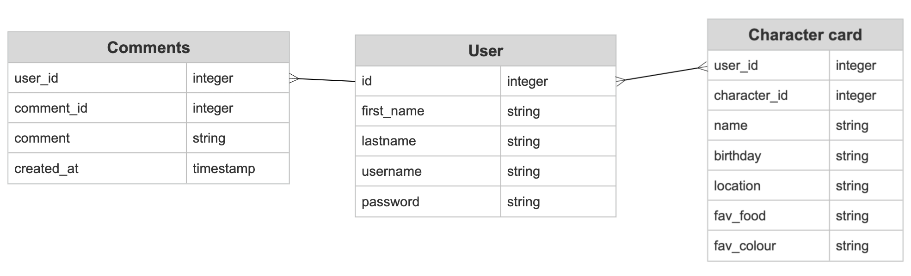
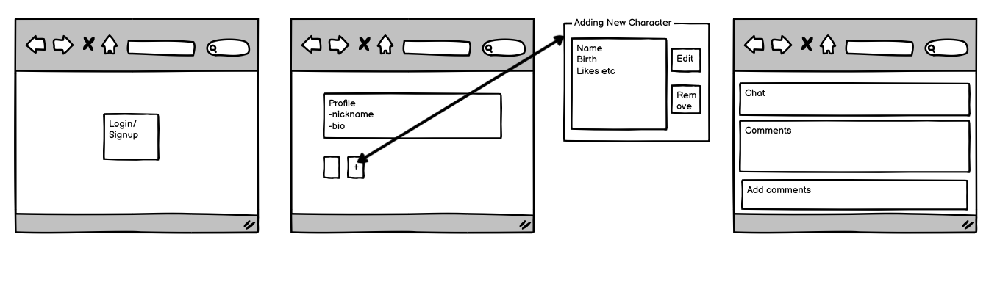
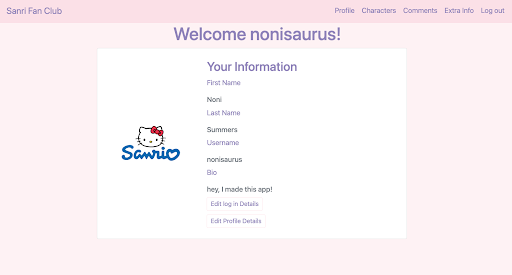

# Sanrio Fan Club

I built a web app for Sanrio fans to store their favourite character cards and engage in discussion via a message board, using Ruby on Rails. The project was completed in four days following two weeks of studying Ruby and related technologies.

Deployment link [here](https://sanrio-fan-club.herokuapp.com/).  

<br>

## Installation 
In order to run this repository on your computer, you will need to have Ruby, Ruby on Rails, and PostgreSQL installed. After installing these dependencies, you can proceed by forking and cloning the repository. Once you have done this, you will need to open your terminal and run the following commands:
- bundle install: This command will install all the required gems (libraries) needed to run the project.
- rails db:create db:migrate: This command will create the database and run any pending migrations.
- rails server: This command will start the Rails server, allowing you to access the application in your web browser.


<br>

## Timeframe
This was a solo project. I had to submit my application idea on day 1 then I had 4 days to finish the project.

<br>

## Technologies Used
- Ruby 3.2.1 programming language
- Rails 7.0.4 web application framework
- PostgreSQL database management system
- Puma as the web server
- Jbuilder for building JSON APIs
- Devise for user authentication
- Bootsnap for faster application boot times
- VSCode for code editing
- Heroku for deployment
- SmartDraw and Balsamiq Wireframes for wireframe


<br>

## Brief
- Build a full stack web application
- Have at least 2 models
  - Auth is a requirement
- Have full CRUD on at least one of your models
- Be able to Add/Delete on any remaining models
- Be deployed on Heroku or similar platform

<br>

## Planning

## Day 1

---

On day one, I invested my time and energy into the planning phase of my project, with a primary focus on establishing realistic timelines and expectations. Initially, I attempted to develop my project using Ruby on Rails as the backend and React as the frontend. However, I encountered significant challenges during the process, which ultimately proved to be too difficult to overcome. As a result, I decided to start over on day two. I dedicated the remainder of the day to carefully planning and strategizing, in order to ensure the success of my project. Although I had intended to incorporate a third model into the project, time constraints prevented me from completing it. I created my ERD and wireframe.





<br>

## Build Process

## Day 2

---

I began my project with a clear plan in mind and proceeded to establish the Ruby on Rails framework as the foundation. Next, I tackled the authorization component, which proved to be relatively straightforward due to the well-documented nature of the process. Utilising Devise provided an excellent starting point for my project, and I was impressed by the abundance of built-in features. The next phase involved the establishment of the correct relationships between my models, which I determined would be best accomplished through a one-to-many approach. After completing my models, I proceeded to create the necessary controllers, a process that required a significant amount of time. Finally, I worked on the implementation of routes, which was a gratifying experience as I was able to witness prompt results on the screen. However, I encountered some challenges in ensuring that everything was correctly linked, which presented a slight issue later on.

## Day 3

---

On day three, I made significant progress in enhancing the user experience of my website. I began by creating a navigation bar, which I complemented with the implementation of Bootstrap to ensure the website's responsiveness. The majority of my time was devoted to perfecting the site's visual appeal and ensuring it accurately reflected my intentions for the project's final review in the General Assembly Software Engineering Immersive course. While undertaking these tasks, I encountered a few issues that required resolution. The issues were ultimately resolved on day four.

<br>

For example: During the development of my project, a situation arose in which creating a new user was intended to generate a specific set of five character cards. However, the application instead added an additional five cards to the entire database, resulting in unintended consequences. Specifically, I had intended each user to begin with five "protected" or undeletable cards. Nonetheless, the issue was identified and resolved on day four of my project.

<br>

I had to generate this Devise controller for the user registration:

```
rails g devise:controllers registrations
```
This creates the necessary controller files to handle user registrations, which are customised to fit the project's requirements.

<br>

Changed routes

```
devise_for :users, controllers: {
    registrations: 'registrations/registrations'
  }
  ```

Changed registrations_controller.rb
```
def create
  super
  resource.save!
  resource.character_cards.create(name: "Hello Kitty",  ...)
end
```

This code adds customization to the user registration process by creating a custom controller, and also adds an additional step of creating a character_card for the user after registration


## Day 4

---

On the final day of the project, I focused on the crucial tasks of debugging and perfecting the CSS styling. Once the debugging was complete, the next priority was deploying the application to ensure it was available to users.

<br>

## Challenges
- I found it quite challenging that the schema couldn't be modified directly and that migration files had to be created to make any changes. Although I understand the benefits of this approach in terms of maintaining data integrity and version control, it was sometimes frustrating to spend extra time creating migration files for minor changes in the code.
- Although Ruby on Rails is generally considered a friendly programming language, setting it up presented my biggest challenge. In my experience, it can be unforgiving if not set up to suit your specific needs.
- Learning a new language in 2 weeks can be challenging, but with some effort, I was able to figure it out.
- At first, navigating in the built-in folders and files was difficult due to the complexity of the framework but by the end of the project I felt more comfortable.


<br>

## Wins
- I am delighted with the visual outcome of this project.
- I am absolutely amazed that I was able to complete this entire Ruby on Rails project in such a short time frame, given that I had only been introduced to it a few weeks prior. The fact that I was able to gain proficiency at this technology and produce a functional project is an achievement that fills me with pride. It required a lot of determination, hard work, and dedication, but I am thrilled with the results and feel incredibly accomplished.
- I was initially apprehensive about the authentication process. However, Devise made it surprisingly straightforward, and I thoroughly enjoyed working with it.




<br>

## Key Learnings
- I have learnt that to deliver quality in a reasonable time frame, I need to pace my work. I learnt from this project the importance of balancing my time. 
- I would like to further discover the capabilities of Devise, as it is an incredibly valuable gem of Ruby. Initially, I found it to be quite intimidating, but as I continued to work on the project, I began to recognise the potential it offers for authentication.


<br>

## Bugs
None known.

<br>

##  Future Improvements

While I am happy with how my project turned out, I do think there's room for improvement. Specifically, I would like to explore the potential addition of advanced features such as a picture upload feature or a live chatbox. Realistically, I think it would be best to work on those in a personal project after the course is finished.

As for the chat box, I explored using a Ruby gem called Turbo as a potential option. While it appears to be quite complex, I am interested in giving it a try in the future. 

<br>

https://github.com/hotwired/turbo-rails
